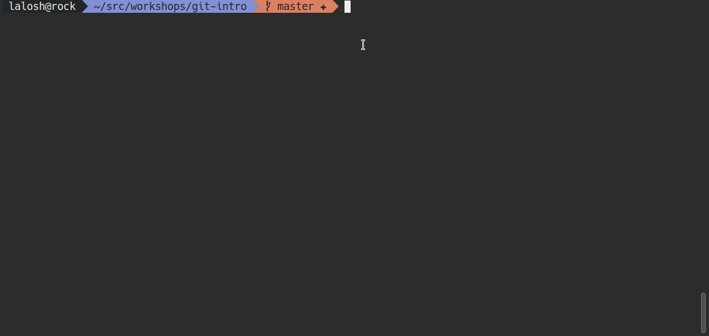
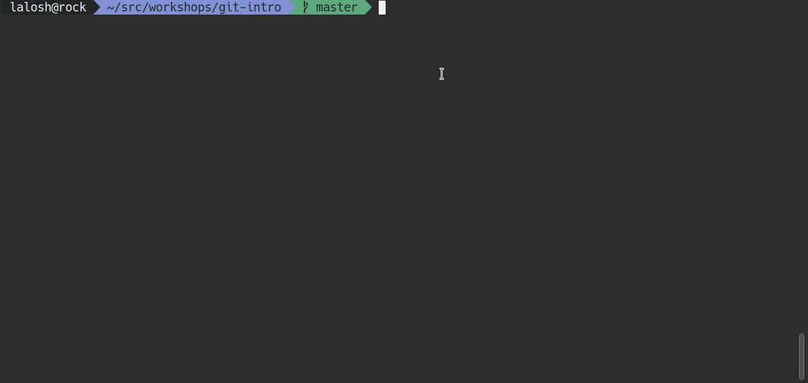

# gitomo-js

Gitomo = Git + Tomo(friend)

CLI Friend that you'll need when using git

# Install 

```sh
npm install -g gitomo

# or

yarn global add gitomo
```


# Commands

- commit   Commit a repository after you see your git status

```sh 
gitomo commit
```


- explain  Explain Git Commands

```sh 
gitomo explain
gitomo explain --language ar
```

Supported Languages: 

- Arabic(ar)
- English(en)




# How Gitomo can help you?

- when doing git commit it will show git status first
- when doing git commit make sure no verb is in past or past participle to enforce a better commits convention 
- status can give you useful warning like 
    - having the same file modified and in stage area 
    - unresolved conflict 
    - not added files after you resolve a conflict 
- add to .gitignore without opening it
- can explain any git command with options in most languages 
- show you contributor's rank sorted in command lines based on different criteria
- ease your life with git diff single file which allow you to choose between commit id without the hassle of copy paste commits hashes
- use github or gitlab integrations so you can create a repo,add members, delete a repo, do merge requests from terminal
- help you to add your ssh key


# All implementations:

- [C#](https://github.com/Gitomo-Git-Tools/gitomo-csharp)
- [C++](https://github.com/Gitomo-Git-Tools/gitomo-cplusplus)
- [javascript](https://github.com/Gitomo-Git-Tools/gitomo-js)

